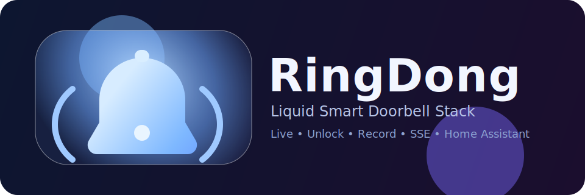

<p align="center">
  
</p>

<h1 align="center">RingDong</h1>

<p align="center">
  <b>Apple-style Smart Doorbell App for Home Assistant.</b><br/>
  Live view, instant unlock, recording pipeline, and real-time event feed — ohne YAML-Zirkus.
</p>

<p align="center">
  
  
  
</p>

## ✨ Git-Style Repo Description

**RingDong** is a standalone, containerized doorbell stack that turns a messy smart-home setup into a clean product experience:

- 📺 **Live view** via WebRTC/go2rtc
- 🔑 **Door unlock API** with MQTT command publishing
- 🎬 **Recording pipeline** (RTSP → ffmpeg clips + latest pointer)
- ⚡ **Realtime timeline** via Server-Sent Events (ding/motion/unlock/clip)
- 🧊 **Liquid-Glass UI** with premium navigation and mobile-first UX

Built for people who want a working doorbell app — not a part-time career in debugging random integrations.

## Architektur

- `app/main.py`:
  - MQTT Subscriber (`ding`, `motion`, `unlock`)
  - SSE endpoint `/events`
  - REST endpoints:
    - `POST /api/unlock`
    - `POST /api/record`
    - `GET /api/config`
  - Recording pipeline via ffmpeg nach `/data/video`
  - Recording index `/recordings` und `/video/<file>`
- `app/static/index.html`:
  - Apple-style Liquid-Glass UI
  - Live, Unlock, Talk-Hinweis, TTS, Eventliste mit Recording-Link
- `assets/logo-ringdong.svg`:
  - Brand logo / wordmark

## Voraussetzungen

- Ring-MQTT / MQTT Broker erreichbar
- RTSP Stream verfügbar (z. B. `rtsp://<host>:8554/<camera>_live`)
- go2rtc API erreichbar (z. B. `http://<host>:1985`)
- Docker + Docker Compose

## Start

```bash
cp .env.example .env
# .env anpassen

docker compose up -d --build
```

App: `http://<host>:8088`

Health:

```bash
curl -s http://<host>:8088/health
```

## API Kurztest

```bash
# manuelle Aufnahme
curl -s -X POST http://<host>:8088/api/record -H 'Content-Type: application/json' -d '{"source":"manual"}'

# Tür öffnen
curl -s -X POST http://<host>:8088/api/unlock

# SSE stream
curl -N http://<host>:8088/events
```

## HA Einbindung (optional)

```yaml
type: iframe
url: http://192.168.10.76:8088
aspect_ratio: 56%
```
